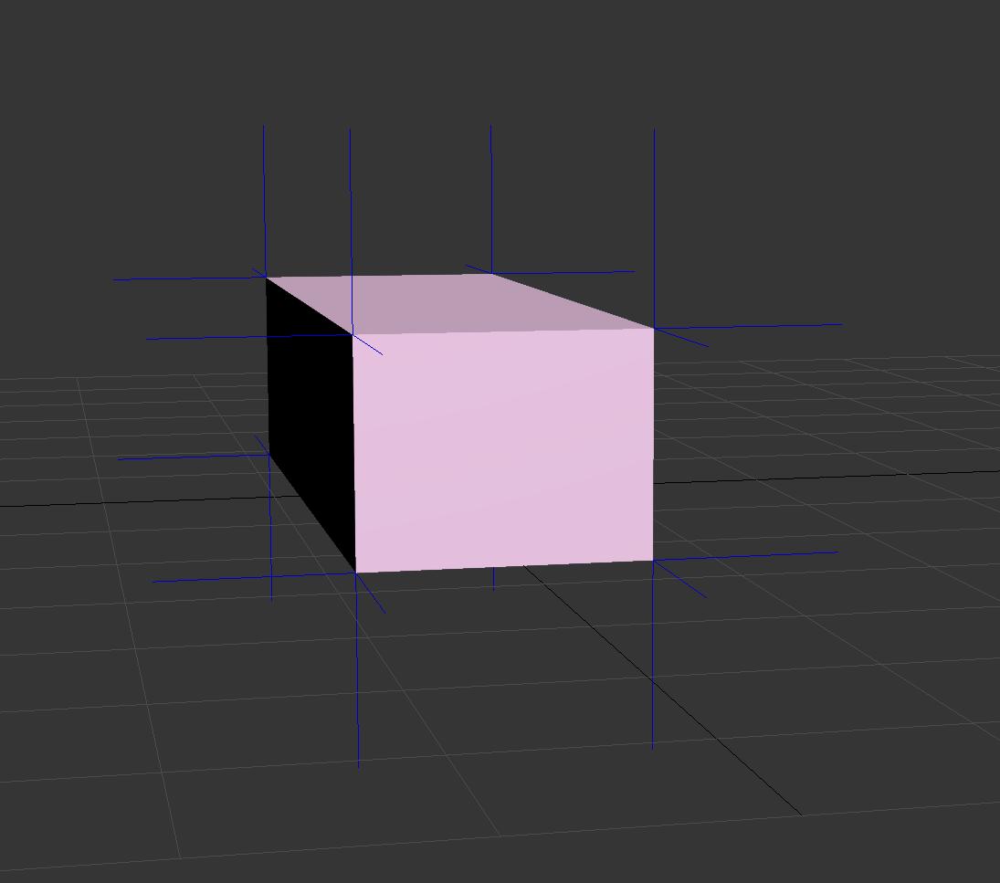
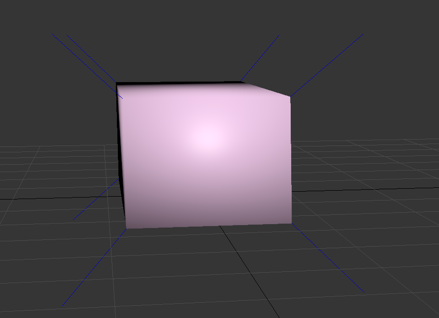
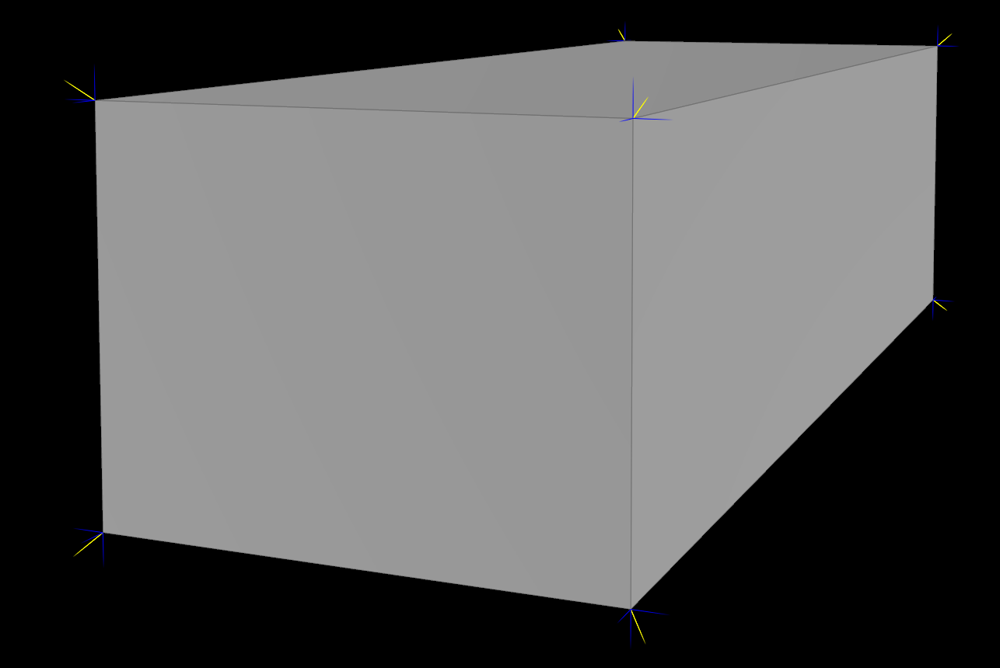

# NormalMerger
FBX normal merge tool

笔记：[黑键 - FBX法线合并工具](https://blog.csdn.net/qjh5606/article/details/117964302)

示例：

输入1：

- 蓝色表示法线。

输入2：

- 蓝色表示法线。

合并结果：

- 蓝色表示法线线通道数据，黄色为切线通道数据。
- 可以看出顺利将输入2的法线合并到输入1中的切线通道。

